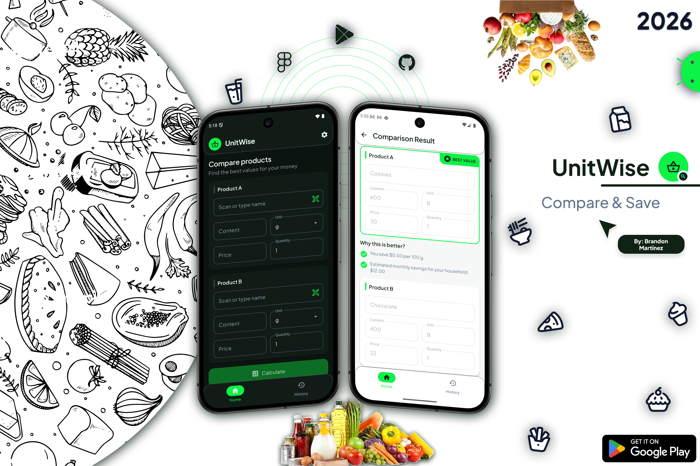
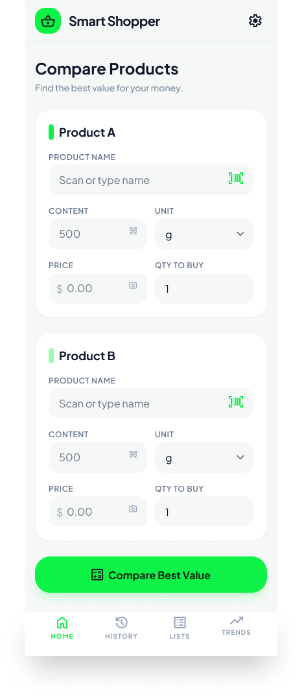
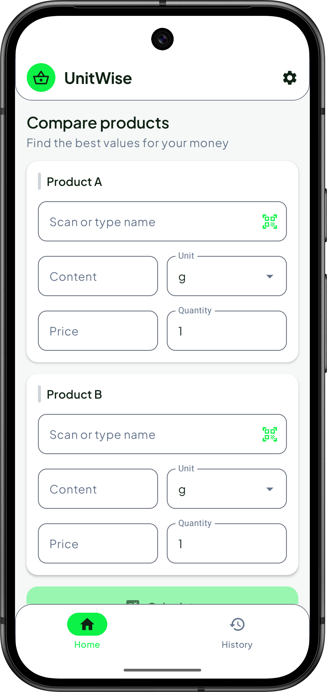
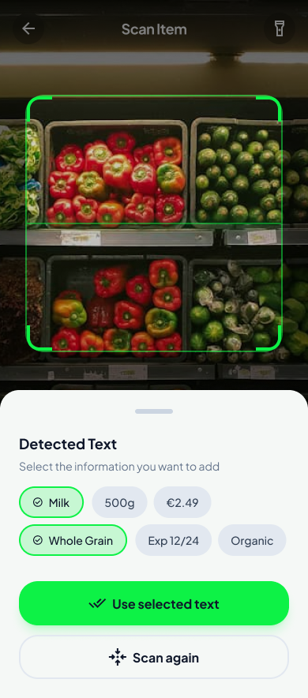
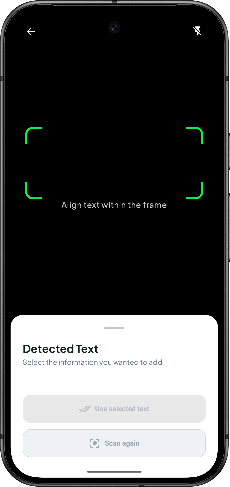
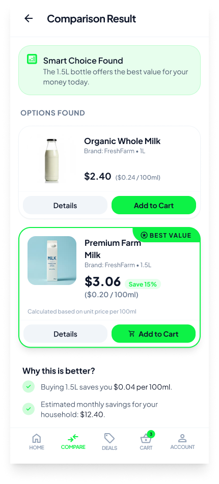
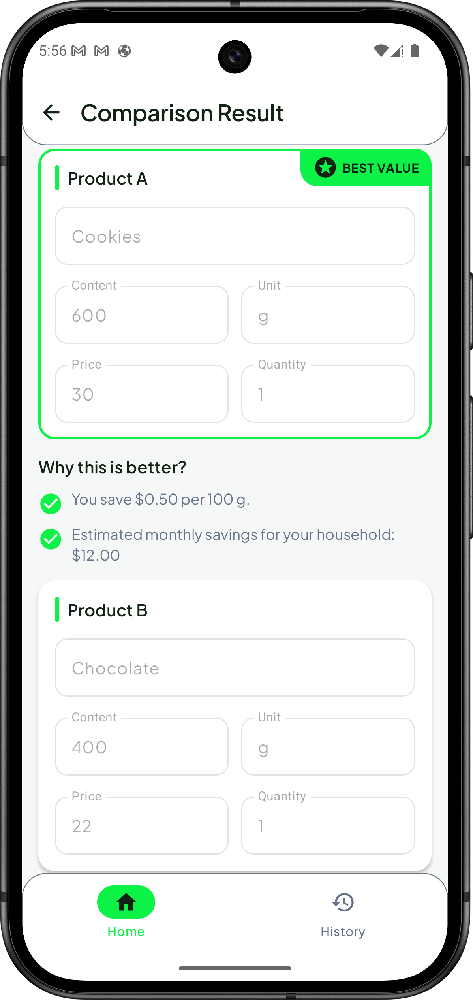

  
  
  
  

  
  

  
  
  

# 🛒 UnitWise — Smart Grocery Comparison App

**UnitWise** is an Android application designed to help users **compare supermarket products and save money** by identifying the best value based on unit pricing.

Instead of guessing which product is cheaper, UnitWise calculates and compares prices automatically, allowing users to make faster and smarter shopping decisions.

The app focuses on simplicity, clarity, and real-world usefulness during everyday grocery supermarket shopping.

---

## Table of Content

- [# 🛒 UnitWise — Smart Grocery Comparison App](#-unitwise--smart-grocery-comparison-app)
- [# ✨ Features](#-features)
- [# 🔜 Coming Soon](#-coming-soon)
- [# 🧠 Problem It Solves](#-problem-it-solves)
- [# 🖼️ Visual Evolution: Stitch AI Inspiration vs. Human-Centered Design](#-visual-evolution-stitch-ai-inspiration-vs-human-centered-design)
- [# 🛠️ Tech Stack](#-tech-stack)
- [# 📱 Platform](#-platform)
- [# 🚀 Project Status](#-project-status)
- [# 🔒 Privacy](#-privacy)
- [# 🤝 Contribution](#-contribution)
- [# 👨‍💻 Author](#-author)

---

# ✨ Features

- **📊 Product Comparison:**
Compare multiple grocery products by price and quantity.
Automatic unit price calculation.

- **📷 Camera Product Scanning:**
Scan product names using the device camera.
Quickly add products without manual typing.

- **🧾 Comparison History:**
Save previous comparisons.
Revisit and reuse results anytime.

- **🎨 Modern UI:**
Built with Jetpack Compose.
Minimal and accessibility-focused design system.

---

# 🔜 Coming Soon

- **🔗 Share Comparisons:**
  Share results with friends or family.
  Generate shareable comparison summaries.

---

# 🧠 Problem It Solves

Many supermarket products use different sizes and prices, making it difficult to know which option is actually cheaper.

UnitWise solves this by:

- Standardizing price comparisons.
- Showing the real cost per unit.
- Reducing decision time while shopping.

---

### 🖼️ Visual Evolution: Stitch AI Inspiration vs. Human-Centered Design

In today's industry, AI-driven prototyping is becoming a key standard for rapid ideation. This project utilizes **Stitch AI** for initial concept mapping, followed by a rigorous human-led refinement process to ensure the interface meets real-world Android production standards.

|                  Stitch AI Exploration (Inspiration)                   |                   Human-Centered Refinement (Final Design)                    | Key Iteration Detail                                                                                                                                                                                                                            |
|:----------------------------------------------------------------------:|:-----------------------------------------------------------------------------:|:------------------------------------------------------------------------------------------------------------------------------------------------------------------------------------------------------------------------------------------------|
|  |      | **UX Simplification:** The AI layout included redundant features like 'Lists' and 'Trends'. My design strips away this noise, simplifying navigation to just **Home** and **History** to focus on fast, on-the-spot price comparisons.          |
|        |         | **Focused Precision:** Unlike the AI concept which processes the entire screen, my design uses a **constrained green framing grid**. ML Kit is programmed to analyze text *only* within this frame, avoiding visual noise from nearby products. |
|   |  | **Scope Reality:** AI envisioned an e-commerce platform with images and "Add to Cart" buttons. **UnitWise** is a pure math utility; it intentionally lacks product databases or images to remain a lightweight and focused tool.                |

---

# 🛠️ Tech Stack

## 📱 Core & UI
* **[Kotlin](https://kotlinlang.org/):** Main language utilizing Coroutines and Flow for asynchronous programming.
* **[Jetpack Compose](https://developer.android.com/compose):** Modern declarative UI with Material 3 and Material Icons Extended.
* **[Lottie Compose](https://github.com/airbnb/lottie-android):** Interactive vector animations for enhanced UX.
* **[Splashscreen API](https://developer.android.com/develop/ui/views/launch/splash-screen):** Native implementation for the application's launch screen.

## 🏛️ Architecture & Data
* **[MVVM (Model-View-ViewModel)](https://www.geeksforgeeks.org/android/mvvm-model-view-viewmodel-architecture-pattern-in-android/):** Pattern used for separation of concerns between business logic and UI.
* **[Room Persistence](https://developer.android.com/training/data-storage/room):** Local database with KSP (Kotlin Symbol Processing) support.
* **[Navigation Compose](https://developer.android.com/develop/ui/compose/navigation):** Robust route management and screen-to-screen navigation.
* **[Lifecycle & ViewModel](https://developer.android.com/topic/libraries/architecture/viewmodel):** Efficient UI state management and lifecycle handling.

## 🔍 AI & Hardware Integration
* **[ML Kit Text Recognition](https://developers.google.com/ml-kit/vision/text-recognition):** On-device image processing for automatic price and product detection.
* **[CameraX](https://developer.android.com/training/camerax):** Robust camera integration for scanning price tags or grocery receipts.

## 🧪 Testing & Quality Assurance (QA)
* **Unit Testing:** [JUnit](https://junit.org/), [MockK](https://mockk.io/) for mocking, [Turbine](https://github.com/cashapp/turbine) for Flow testing, and [Google Truth](https://truth.dev/) for fluent assertions.
* **UI & Instrumentation Testing:** [Espresso](https://developer.android.com/training/testing/espresso) and Compose UI Test to ensure interface integrity.
* **KSP (Kotlin Symbol Processing):** High-performance code generation for Room database.

---

# 📱 Platform

* Android Native Application
* Minimum SDK: **24+**
* Target SDK: **Latest Android version (36)**

---

# 🚀 Project Status

Current stage:

* ✅ MVP completed
* ✅ Closed testing on Google Play
* 🔄 Continuous improvements and UX refinements

---

# Design Process

The UI design combines:

* AI-assisted exploration using Stitch AI
* Manual UX/UI refinement and decision-making
* Iterative usability validation

AI designs were used as inspiration, while final interfaces were adapted to better match real user workflows.

---

# 🔒 Privacy

- UnitWise does not require unnecessary personal data.
- All comparisons are stored locally.

---

# 🤝 Contribution

This project is currently maintained as a personal production app.
**Suggestions and feedback are welcome through issues.**

---

# 👨‍💻 Author
**[BR444N](https://github.com/BR444N)**

Developed as a native Android project focused on learning, product design, and real-world usability.

📧 **Contact:** [josebrandonmartinezrios@duck.com](mailto:josebrandonmartinezrios@duck.com)